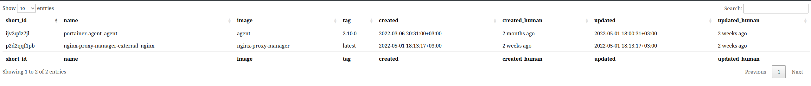

# Генератор списка запущенных сервисов в Docker stack в JSON
<!-- markdownlint-disable MD013 -->

- [Генератор списка запущенных сервисов в Docker stack в JSON](#генератор-списка-запущенных-сервисов-в-docker-stack-в-json)
  - [Примеры работы](#примеры-работы)
    - [Endpoint `/`](#endpoint-)
    - [Endpoint `/ajax`](#endpoint-ajax)
    - [Endpoint `/table`](#endpoint-table)
  - [Требования](#требования)
  - [Конфигурация](#конфигурация)
  - [Сборка Docker образа](#сборка-docker-образа)
  - [Запуск](#запуск)
    - [venv](#venv)
    - [docker](#docker)
    - [docker-compose](#docker-compose)
  
Служба, которая подключается к `/var/run/docker.sock`, и отдаёт список запущенных сервисов в формате JSON

## Примеры работы

### Endpoint `/`

Основной Endpoint, для отдачи информации в Confluence

Параметры:

- `format` - формат ответа. `json`, `xml`, `yaml`, `yml`. Параметр не обязательный.

Пример ответа:

```json
[
  {
    "cluster_name": "docker_swarm",
    "data": [
      {
        "short_id": "ijv2qdz7jl",
        "name": "portainer-agent_agent",
        "stack": "portainer-agent",
        "image": "agent",
        "tag": "2.10.0",
        "created": "2022-03-06 20:31:00+03:00",
        "created_human": "2 months ago",
        "updated": "2022-05-01 18:00:31+03:00",
        "updated_human": "3 weeks ago",
        "replication_mode": "Global",
        "replica_count": 1,
        "tasks_count": 5,
        "tasks_running": 1,
        "tasks_shutdown": 4,
        "cluster_name": "docker_swarm"
      },
      {
        "short_id": "p2d2qqf1pb",
        "name": "nginx-proxy-manager-external_nginx",
        "stack": "nginx-proxy-manager-external",
        "image": "nginx-proxy-manager",
        "tag": "latest",
        "created": "2022-05-01 18:13:17+03:00",
        "created_human": "3 weeks ago",
        "updated": "2022-05-21 02:17:09+03:00",
        "updated_human": "2 days ago",
        "replication_mode": "Replicated",
        "replica_count": 1,
        "tasks_count": 2,
        "tasks_running": 1,
        "tasks_shutdown": 1,
        "cluster_name": "docker_swarm"
      }
    ]
  }
]
```

```xml
  <cluster_name>docker_swarm</cluster_name>
  <data>
    <cluster_name>docker_swarm</cluster_name>
    <created>2022-03-06 20:31:00+03:00</created>
    <created_human>2 months ago</created_human>
    <image>agent</image>
    <name>portainer-agent_agent</name>
    <replica_count>1</replica_count>
    <replication_mode>Global</replication_mode>
    <short_id>ijv2qdz7jl</short_id>
    <stack>portainer-agent</stack>
    <tag>2.10.0</tag>
    <tasks_count>5</tasks_count>
    <tasks_running>1</tasks_running>
    <tasks_shutdown>4</tasks_shutdown>
    <updated>2022-05-01 18:00:31+03:00</updated>
    <updated_human>3 weeks ago</updated_human>
  </data>
  <data>
    <cluster_name>docker_swarm</cluster_name>
    <created>2022-05-01 18:13:17+03:00</created>
    <created_human>3 weeks ago</created_human>
    <image>nginx-proxy-manager</image>
    <name>nginx-proxy-manager-external_nginx</name>
    <replica_count>1</replica_count>
    <replication_mode>Replicated</replication_mode>
    <short_id>p2d2qqf1pb</short_id>
    <stack>nginx-proxy-manager-external</stack>
    <tag>latest</tag>
    <tasks_count>2</tasks_count>
    <tasks_running>1</tasks_running>
    <tasks_shutdown>1</tasks_shutdown>
    <updated>2022-05-21 02:17:09+03:00</updated>
    <updated_human>2 days ago</updated_human>
  </data>
```

```yaml
- cluster_name: docker_swarm
  data:
  - cluster_name: docker_swarm
    created: '2022-03-06 20:31:00+03:00'
    created_human: 2 months ago
    image: agent
    name: portainer-agent_agent
    replica_count: 1
    replication_mode: Global
    short_id: ijv2qdz7jl
    stack: portainer-agent
    tag: 2.10.0
    tasks_count: 5
    tasks_running: 1
    tasks_shutdown: 4
    updated: '2022-05-01 18:00:31+03:00'
    updated_human: 3 weeks ago
  - cluster_name: docker_swarm
    created: '2022-05-01 18:13:17+03:00'
    created_human: 3 weeks ago
    image: nginx-proxy-manager
    name: nginx-proxy-manager-external_nginx
    replica_count: 1
    replication_mode: Replicated
    short_id: p2d2qqf1pb
    stack: nginx-proxy-manager-external
    tag: latest
    tasks_count: 2
    tasks_running: 1
    tasks_shutdown: 1
    updated: '2022-05-21 02:17:09+03:00'
    updated_human: 2 days ago
```

Где:

- `short_id` - ID службы
- `name` - имя службы
- `stack` - имя стека
- `image` - имя docker образа
- `tag` - тег docker образа
- `created` - Время создания сервиса
- `created_human` - Время создания сервиса в виде строки "столько времени назад"
- `updated` - Время обновления сервиса
- `updated_human` - Время обновления сервиса в виде строки "столько времени назад"
- `tasks_count` - Общее количество заданий в сервисе
- `tasks_running` - Количество заданий в сервисе в состоянии `running`
- `tasks_shutdown` - Количество заданий в сервисе в состоянии `shutdown`
- `cluster_name` - см. [Конфигурация](#конфигурация)

### Endpoint `/ajax`

Вспомогательный Endpoint для работы с [Endpoint `/table`](#endpoint-table)

Пример ответа:

```json
{
    "cluster_name": "docker_swarm",
    "data": [
        {
            "short_id": "ijv2qdz7jl",
            "name": "portainer-agent_agent",
            "stack": "portainer-agent",
            "image": "agent",
            "tag": "2.10.0",
            "created": "2022-03-06 20:31:00+03:00",
            "created_human": "2 months ago",
            "updated": "2022-05-01 18:00:31+03:00",
            "updated_human": "2 weeks ago",
            "tasks_count": 5,
            "tasks_running": 1,
            "tasks_shutdown": 4,
            "cluster_name": "docker_swarm"
        },
        {
            "short_id": "p2d2qqf1pb",
            "name": "nginx-proxy-manager-external_nginx",
            "stack": "nginx-proxy-manager-external",
            "image": "nginx-proxy-manager",
            "tag": "latest",
            "created": "2022-05-01 18:13:17+03:00",
            "created_human": "2 weeks ago",
            "updated": "2022-05-01 18:13:17+03:00",
            "updated_human": "2 weeks ago",
            "tasks_count": 1,
            "tasks_running": 1,
            "tasks_shutdown": 0,
            "cluster_name": "docker_swarm"
        }
    ]
}
```

Где:

- `short_id` - ID службы
- `name` - имя службы
- `stack` - имя стека
- `image` - имя docker образа
- `tag` - тег docker образа
- `created` - Время создания сервиса
- `created_human` - Время создания сервиса в виде строки "столько времени назад"
- `updated` - Время обновления сервиса
- `updated_human` - Время обновления сервиса в виде строки "столько времени назад"
- `tasks_count` - Общее количество заданий в сервисе
- `tasks_running` - Количество заданий в сервисе в состоянии `running`
- `tasks_shutdown` - Количество заданий в сервисе в состоянии `shutdown`
- `cluster_name` - см. [Конфигурация](#конфигурация)

### Endpoint `/table`



## Требования

- Python 3.8+
- python-flask
- python-docker
- python-arrow
- Кластер docker swarm
- Доступ на чтение к /var/run/docker.sock

## Конфигурация

При первом запуске создаёт файл `config.ini` со следующим содержимым:

```ini
[app]
loglevel = INFO
delta = 600
blacklist = 
header = docker_swarm
cachefile = CachedResp.json
timezone = Europe/Moscow
without_tasks = no

[http]
host = 0.0.0.0
port = 8080
```

Где:

- `app.loglevel` - уровень логирования службы. `DEBUG`/`INFO`/`WARNING`/`ERROR`
- `app.delta` - минимальное время между запросами к `/var/run/docker.sock` в секундах
- `app.blacklist` - список названий сервисов, разделённых запятой, которые не надо включать в JSON. `service_app1,service_app2,service_app3`
- `app.header` - значение элемента JSON `cluster_name`
- `app.cachefile` - путь до файла с кешем ответов от docker
- `app.timezone` - Временная зона для вывода created и updated. См. [список временных зон](https://en.wikipedia.org/wiki/List_of_tz_database_time_zones), List -> TZ database name
- `app.without_tasks` - Показывать ли сервисы без запущенных экземпляров. `yes`/`1`/`true`/`no`/`0`/`false`
- `http.host` - IP, на котором слушает HTTP служба. Один из IP хоста или `0.0.0.0`
- `http.port` - Порт, на котором слушает HTTP служба. Для использования портов <1024 нужны права пользователя `root` или привелегия `CAP_NET_ADMIN`

## Сборка Docker образа

```bash
docker build . --tag registry/image:tag
```

## Запуск

### venv

```bash
python -m venv .venv
source .venv/bin/activate
pip instarr -r req.txt
./main.py
```

### docker

Запуск со стандартной конфигурацией

```bash
docker run -d -p 8080:8080 -v /var/run/docker.sock:/var/run/docker.sock:ro registry/image:tag
```

Запуск со своей конфигурацией

```bash
docker run -d -p 8080:8080 -v /var/run/docker.sock:/var/run/docker.sock:ro -v $PWD/config.ini:/app/config.ini registry/image:tag
```

### docker-compose

```bash
docker-compose up -d
```
